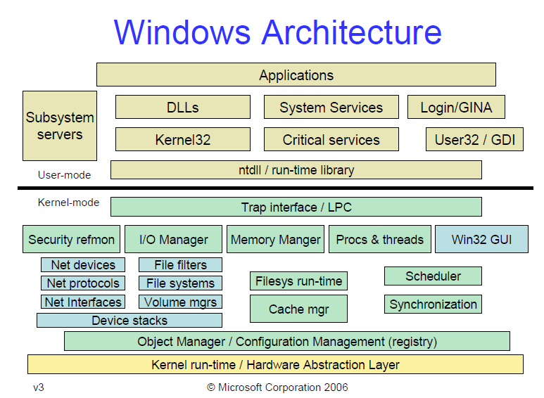

## Windows System Architecture

Obligatory overview of Windows system architecture.

### System Architecture Overview

It is difficult to find a more succinct overview of Windows system architecture than this image.



### Core Windows Components

The overall architecture of the Windows operating system is typically broken down into the following core components:
- Environment Subsystems: environment subsystems are user-mode processes that implement a specific Windows environment subsystem server; these environment subsystem servers manage various aspects of user-mode processes that target that subsystem such as tracking process and thread creation and implementing certain subsystem API calls; examples of environment subsystem processes include the Client-Server Runtime Subsystem (_csrss.exe_) and the Session Manager Subsystem (_smss.exe_)
- System Processes: system processes are standard (for the most part, some are now implemented as protected processes or even trustlets) Windows processes that implement some critical system functionality; system processes are those that are always active by default on any Windows system; examples of system processes include the init process (_wininit.exe_), the logon process (_winlogon.exe_), and the System process (no associated image)
- Services: Windows services are user-mode processes that interface with the Windows Service Control Manager (SCM); services are typically used to implement long-running system-level tasks such as Windows Defender Anti-Malware
- Applications: application programs are any user-mode process that does not fall into the preceding three categories; note that on modern versions of Windows the degree of variation among Windows applications has grown substantially; for instance, standard desktop applications, protected processes, Universal Windows Platform applications, and trustlets all fall into the category of Windows applications
- Subsystem DLLs: subsystem DLLs expose the functionality of the subsystem for which they defined; these DLLs are then linked against by user-mode applications in order to access operating system routines and resources
- System Support Library (_ntdll.dll_): the system support library exposes the Windows native API; this is the lowest level API available to code that executes in user-mode context and serves as the bridge between user-mode and kernel-mode execution 
- System Service Dispatcher: the system service dispatcher is the uppermost layer of the Windows Executive; the system service dispatcher is responsible for dispatching system service request from user-mode to the appropriate kernel-mode implementation that may service that request
- Windows Executive and Executive Subsystems: the Windows Executive implements the high-level API of the Windows kernel; the Executive is comprised of various subsystems which are merely logical divisions in functionality among the Executive's components; Executive subsystems include the IO Manager, the Security Reference Monitor, the Power Manager, the Memory Manager, the Plug and Play Manager, the Process Manager, the Object Manager, and the Configuration Manager
- Device and Filesystem Drivers: device and filesystem drivers implement the routines that ultimately interact with physical devices such as ports, peripherals, and storage media; the entire space of device and filesystem drivers is organized into a logical device tree upon which the Windows layered IO model is built
- Windows Graphics Drivers: graphics drivers implement the low-level support for the windowing system
- Windows Kernel: the Windows Kernel implements the low-level system facilities upon which the Windows Executive is built; these facilities include thread scheduling, synchronization services, and interrupt and execution dispatching
- Hardware Abstraction Layer (HAL): the HAL implements the platform-specific components necessary for Windows to run on a variety of platforms
- Hypervisor (Hyper-V): the Windows hypervisor further abstracts the operating system away from the underlying hardware upon which it executes; the hypervisor is the component that enables many new Windows features including virtualization-based security

### User Mode Processes

In general, there are four (4) types of user-mode processes on Windows:

- User Processes: standard user applications, 16, 32, or 64 bit
    - ex: _notepad.exe_
- Service Processes: processes that host Windows services; may exist outside of any single user logon session; may be hosted by _svchost.exe_
    - ex: task scheduler
- System Processes: fixed processes that are NOT managed by the SCM; some are considered critical, meaning that terminating said process results in system crash
    - ex: _lsass.exe_
- Environment Subsystem Server Processes: implement the support for the OS subsystem presented to the user; some are considered critical, meaning that terminating said process results in system crash
    - ex: _csrss.exe_
 
### Core Subsystem DLLs

Subsystem DLLs are those DLLs that expose the subsystem API to use mode applications that target that subsystem. They serve as the intermediary between user mode applications and the system support library, _ntdll.dll_.

Windows was originally designed to host multiple _subsystems_, allowing different applications to target different subsystems and thereby access different subsets of the total functionality exported by the OS. However, modern versions of Windows only (really) support a single subsystem: the Windows subsystem. The Windows subsystem is implemented by a number of subsystem DLLs that expose the subsystem API to user mode applications. Four of the most important such DLLs include:

- _kernel32.dll_: exposes most of the Win32 base APIs
- _advapi32.dll_: security calls and functions for manipulating the registry
- _user32.dll_: the user component of Windows GUI rendering and window events
- _gdi32.dll_: graphics device interface, low level primitives for rendering graphics

To really dig into what each of these subsystem DLLs do, one has but to run the four following commands:

```
dumpbin /EXPORTS kernel32.dll
dumpbin /EXPORTS advapi32.dll
dumpbin /EXPORTS user32.dll
dumpbin /EXPORTS gdi32.dll
```
A summary of the results of running this experiment on my system (Windows 10.0.18362) is shown below.

_kernel32.dll_ exports 1603 functions. Examples include:

- `HeapCreate()`
- `OpenProcess()`
- `SetThreadContext()`
- `WriteConsoleA()`

_advapi32.dll_ exports 1857 functions. Examples include:

- `EncryptFileA()`
- `InitializeSecurityDescriptor()`
- `OpenProcessToken()`
- `RegSetValueA()`
- `WmiOpenBlock()`

_user32.dll_ exports 2716 functions (many of which are exported by ordinal only). Examples include:

- `GetForegroundWindow()`
- `MessageBoxA()`
- `SetWindowLongA()`
- `TrackMouseEvent()`

_gdi32.dll_ exports 1016 functions. Examples include:

- `EngFillPath()`
- `GetTextColor()`
- `PolylineTo()`
- `StrokePath()`

The export examples from each subsystem DLL are illustrative of the particular role that each is meant to serve in implementing the Windows subsystem.

**Aside: _kernel32.dll_ vs _kernelbase.dll_**

Starting with Windows 7, Windows introduced a new layer of indirection into core system DLL export resolution and implementation in an attempt to minimize the cost to applications of requesting OS services. The _kernel32.dll_ vs _kernelbase.dll_ distinction is one such example of this change in which the _kernelbase.dll_ binary was introduced in Windows 7 and now contains the implementation of various functions from _kernel32.dll_ (as well as _advapi32.dll_). This implies that the actual function exports from _kernel32.dll_ are in fact forwarded to implementations in _kernelbase.dll_. 

See the experiment "Kernel32Forwarding" for a demonstration of this behavior.

### System Support Library (ntdll.dll)

The system support library, _ntdll.dll_, has the following properties:

- Exports the "native API"
- The lowest level OS interface available to user mode
- Responsible for issuing system calls, transitioning to and from kernel mode
- Supports native applications (those with no subsystem)
- Also used extensively by programs that run in user mode early during system initialization
    - e.g. _csrss.exe_ implements the Windows subsystem, and thus cannot rely on the Windows subsystem, so it must be a native application that utilizes the native API directly
    - e.g. _smss.exe_ managers user sessions and initializes subsystems, and thus cannot rely on the Windows subsystem
 
### Windows Subsystem

The Windows subsystem is the primary subsystem utilized by all modern Windows applications (by this I do not mean UWP apps). 

The environment subsystem process for the Windows subsystem is the Client Server Runtime Subsystem, _csrss.exe_.

### Windows 10 System Processes

Instead of trying to write up my own (inadequate) recreation, I will instead simply link to the [Hunt Evil Poster](Local/SANS_Poster_2018_Hunt_Evil_FINAL.pdf) from SANS that beautifully describes all of the Windows 10 system processes.

The system processes found on a default-configured Windows 10 system include the following:

- `System`: the system process is responsible for most kernel-mode threads; modules that run under the `System` process include device drivers, several critical DLLs, and the kernel executable itself
- `smss`: the Session Manager Subsystem is responsible for creating and managing Windows sessions; the first instance the Session Manager process creates a child instance for each new session on the system which eventually exits after the session has been initialized
- `wininit`: the Init process starts several critical background processes within session 0 upon initial system startup including the Service Control Manager process, the Local Security Authority process, and, on systems with Credential Guard enabled, the secure Local Security Authority process
- `RuntimeBroker`: the runtime broker process acts as an intermediary between processes that execute in a constrained context and the full range of services provided by the operating system; examples of applications that make use of a runtime broker instance include Universal Windows Platform applications that execute within AppContainer sandboxes and applications that execute within the sandbox provided by Windows Defender Application Guard
- `taskhostw`: the generic host process in which Windows tasks execute
- `winlogon`: the logon process manages interactive user logon and logoff events
- `csrss`: the Client-Server Runtime Subsystem implements the environment subsystem server for the Windows subsystem
- `services`: implements the Service Control Manager (SCM) and the Unified Background Process Manager (UBPM)
- `svchost`: the generic host process for Windows services
- `lsass`: the vanilla-implementation of the Local Security Authority process; this process is responsible for user authentication
`lsaiso`: the secure version of the Local Security Authority process that executes as a trustlet in Isolated User Mode (IUM); this process is only present in the event that Virtualization-Based Security and Credential Guard are enabled
- `explorer`: the default shell application that provides interactive user access to files, the desktop, the taskbar, the control panel, among other things 

### References

- _Windows Internals, 7th Edition Part 1_ Pages 45-99
